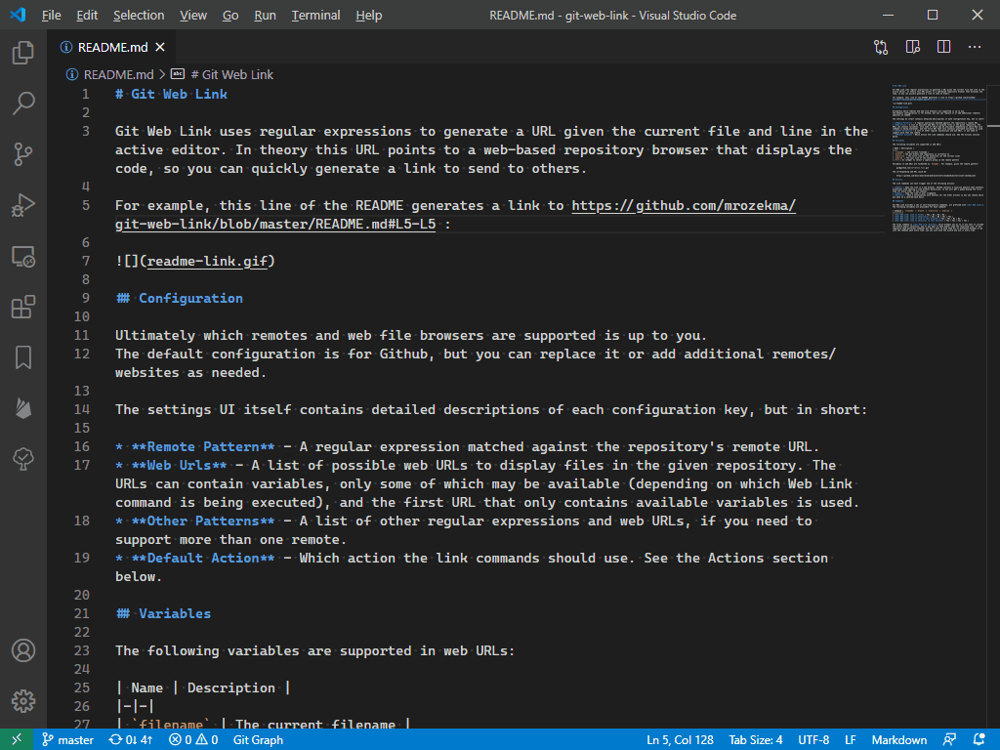
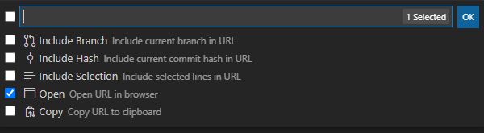

# Git Web Link

Git Web Link uses regular expressions to generate a URL given the current file and line in the active editor. In theory this URL points to a web-based repository browser that displays the code, so you can quickly generate a link to send to others.

For example, this line of the README generates a link to https://github.com/mrozekma/git-web-link/blob/master/README.md#L5-L5 :

## Configuration

Ultimately which remotes and web file browsers are supported is up to you.
The default configuration is for Github, but you can replace it or add additional remotes/websites as needed.

The settings UI itself contains detailed descriptions of each configuration key, but in short:

* **Remote Pattern** - A regular expression matched against the repository's remote URL.
* **Web Urls** - A list of possible web URLs to display files in the given repository. The URLs can contain variables, only some of which may be available (depending on which Web Link command is being executed), and the first URL that only contains available variables is used.
* **Other Patterns** - A list of other regular expressions and web URLs, if you need to support more than one remote.
* **Default Action** - Which action the link commands should use. See the Actions section below.

## Variables

The following variables are supported in web URLs:

| Name | Description |
|-|-|
| `filename` | The current filename |
| `branch` | The Git branch the repository is currently on
| `startLine` | The first line of the selection (or the current line)
| `endLine` | The last line of the selection
| *`N`* | An integer to select a capture group in the remote pattern

Variables in web URLs are formatted as `${name}`. For example, given the remote pattern:

    git@github.com:([^/]+)/(.+)\\.git

The corresponding web URL could be:

    https://github.com/${1}/${2}/blob/${branch}/${filename}#L${startLine}-L${endLine}

## Actions

The link commands can each trigger one of the following actions:

* **Open** - Open the link in a web browser. VSCode contains a security measure that prevents extensions from opening a link without permission, so you will get a popup dialog the first time (or every time, if you choose).
* **Copy** - Copy the link to your clipboard.
* **Notify** - Show a notification with buttons for the other actions so you can choose which you want on a case-by-case basis.

## Commands

Git Web Link provides a set of self-explanatory commands, all prefixed with **Git Web Link:**. The following variables are available for each command:

| Command | `filename` | `branch` | `startLine` | `endLine` |
|-|-|-|-|-|
| **Git Web Link: Link to file** | Yes | No | No | No |
| **Git Web Link: Link to selection** | Yes | No | Yes | Yes |
| **Git Web Link: Link to file on this branch** | Yes | Yes | No | No |
| **Git Web Link: Link to selection on this branch** | Yes | Yes | Yes | Yes |

The final command is **Git Web Link: Wizard**, which prompts if you want to include the branch and/or selection, and if you want to open and/or copy the resulting link:

If you regularly need different commands but don't want to bind them all to different hotkeys or go into the command pane every time, you can just bind the wizard and use it every time.
